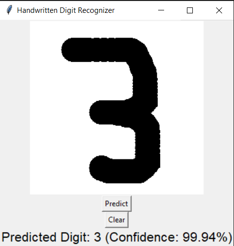

# Handwritten Digit Recognizer

This project is a simple handwritten digit recognition system using a Convolutional Neural Network (CNN) trained on the MNIST dataset. It provides a graphical user interface (GUI) built with Tkinter, allowing users to draw digits and get real-time predictions.

## Features

- Draw digits (0-9) on a canvas and predict them instantly.
- Trained using the MNIST dataset with a CNN implemented in TensorFlow/Keras.
- Model accuracy and training history visualization.
- Easy-to-use GUI for digit input and prediction.

## Project Structure

```
.
├── app.py                      # Tkinter GUI for digit drawing and prediction
├── model.py                    # Model training and saving script
├── handwritten_digit_model.h5  # Trained Keras model
├── Figure_1.png                # (Optional) Training history plot
├── SampleOutput_1.png          # (Optional) Example output screenshot
├── SampleOutput_2.png          # (Optional) Example output screenshot
└── .gitignore
```

## Requirements

- Python 3.x
- TensorFlow
- NumPy
- Pillow (PIL)
- Matplotlib (for training visualization)
- Tkinter (usually included with Python)

Install dependencies with:

```sh
pip install tensorflow numpy pillow matplotlib
```

## How to Train the Model

1. Run the training script:
   ```sh
   python model.py
   ```
2. This will train the CNN on the MNIST dataset and save the model as `handwritten_digit_model.h5`.

## How to Run the GUI App

1. Ensure `handwritten_digit_model.h5` is present in the project directory.
2. Run the app:
   ```sh
   python app.py
   ```
3. Draw a digit on the canvas and click **Predict** to see the model's prediction and confidence.

## Example



## License

This project is for educational purposes.

---

**Author:** UDHAYABOOPATHI V
**Contact:** udhayaboopathi2003@gmail.com